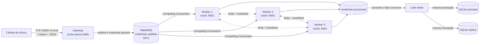

# MediChain Sync

Todas as linhas de código Python têm comentários imediatamente acima; SQL e configurações também estão comentados. Este repositório contém os componentes de execução e a documentação obrigatória do trabalho.

Protótipo didático de uma rede distribuída de prontuários médicos. Clínicas diferentes enviam atualizações ao mesmo paciente sem bloquear o cliente; três workers dividem o processamento; relógios vetoriais detectam causalidade e conflitos; o algoritmo Bully elege um único líder para consolidar e replicar os dados.

## Grupo 9 - Tema 6

| Integrante | Matrícula |
|---|---|
| André Rezende Muruci de Mendonça | **PREENCHER ANTES DA ENTREGA** |
| Fábio Henrique dos Santos Buecker | **PREENCHER ANTES DA ENTREGA** |
| Lucas Ribeiro Tomé | **PREENCHER ANTES DA ENTREGA** |

As matrículas não aparecem nos PDFs fornecidos e, por isso, não foram inventadas.

## O problema resolvido

Dois profissionais podem alterar o mesmo prontuário em clínicas diferentes. Horários físicos não são suficientes para afirmar qual atualização causou a outra. O projeto leva com cada evento um relógio vetorial clínico. Assim, o sistema reconhece quatro situações:

- `before`: a atualização recebida é anterior ao estado atual e fica somente na auditoria;
- `after`: a atualização conhece o estado anterior e pode substituí-lo;
- `equal`: os vetores são iguais;
- `concurrent`: nenhuma atualização conhece a outra; há um conflito real.

Em um conflito, os dois eventos permanecem no histórico. Para o protótipo sempre produzir a mesma visão consolidada, uma chave determinística baseada no vetor e no `event_id` escolhe temporariamente um vencedor. Depois, uma nova atualização cujo vetor conhece os dois eventos resolve causalmente o caso.

## As três entidades obrigatórias

1. `Clinic`: posto de saúde que origina atualizações.
2. `MedicalRecordUpdate`: evento de alteração de um campo do prontuário.
3. `AuditRecord`: registro do processamento, relação causal e decisão do líder.

O banco também mantém `record_state` (estado consolidado) e `conflicts` (eventos concorrentes).

## Arquitetura e portas



| Porta | Componente | Finalidade |
|---|---|---|
| 15000 | Gateway no computador | Receber mensagens TCP dos clientes |
| 5000 | Gateway na rede Docker | Porta interna do container |
| 5672 | RabbitMQ | Protocolo AMQP usado internamente pelos containers |
| 15673 | RabbitMQ Management no computador | Tela web opcional, usuário e senha `guest` |
| 6001 | Worker 1 | Eleição e heartbeat na rede interna do Compose |
| 6002 | Worker 2 | Eleição e heartbeat na rede interna do Compose |
| 6003 | Worker 3 | Eleição e heartbeat na rede interna do Compose |

## Fluxo ponta a ponta

1. O cliente transforma a atualização em JSON.
2. O protocolo envia primeiro um inteiro de 4 bytes com o tamanho do JSON. Isso é o framing explícito exigido para Socket TCP.
3. O gateway cria uma thread para o cliente, valida os campos, publica uma mensagem persistente em `medichain.updates` e responde `queued`.
4. Um dos três workers recebe o evento pelo padrão Competing Consumers.
5. O worker mescla o relógio vetorial de processamento e incrementa seu próprio contador dentro de um `Lock`.
6. O worker publica o resultado em `medichain.processed` e só então envia `ack` para a mensagem original.
7. O maior worker vivo é eleito líder pelo algoritmo Bully. Somente ele retira eventos da fila processada.
8. O líder compara o relógio clínico recebido com o vetor consolidado, registra a auditoria e escreve nas duas cópias SQLite.
9. Se ocorrer uma exceção antes do fim, o worker envia `nack` com `requeue=True`; a mensagem volta para a fila.
10. Se o heartbeat falhar três vezes, os seguidores iniciam uma nova eleição automaticamente.

## Correspondência com os requisitos

| Requisito | Onde foi implementado |
|---|---|
| R1 - Socket TCP, framing e concorrência | `src/protocol.py` e `src/gateway.py` |
| R2 - RabbitMQ e rastreabilidade | `src/broker.py`; filas duráveis, mensagens persistentes, IDs e vetores |
| R3 - três workers e race condition | `docker-compose.yml`, `src/worker.py`, `threading.Lock` |
| R4 - relógios vetoriais | `src/vector_clock.py` e atualização em cada worker |
| R5 - algoritmo Bully e líder único | `src/election.py`; só o líder chama `storage.consolidate` |
| R6 - falhas e reprocessamento | heartbeat, reconexão, `ack` após sucesso e `nack/requeue` em erro |
| Memória intacta | `src/storage.py` e `database/schema.sql`; principal, réplica, auditoria, conflitos e idempotência |
| Tipagem e exceções | type hints em todo o código e blocos de tratamento nas fronteiras de rede/banco |

## Pré-requisitos

- Docker Desktop com Docker Compose;
- Python 3.10 ou superior para executar cliente e testes;
- portas 15000 e 15673 livres no computador.

No computador, somente o gateway 15000 e a tela 15673 são expostos. As demais portas ficam na rede interna do Compose. Esses valores evitam conflito com serviços que normalmente usam 5000 e 15672. Se ainda estiverem ocupados, copie `.env.example` para `.env` e altere `GATEWAY_HOST_PORT` ou `RABBITMQ_UI_HOST_PORT`.

Não é necessário instalar RabbitMQ ou SQLite manualmente. O Compose fornece o broker, e o SQLite já acompanha o Python.

## Execução passo a passo

Abra o PowerShell ou terminal dentro da pasta `medichain-sync`.

### 1. Subir toda a infraestrutura

```powershell
docker compose up --build -d
```

### 2. Acompanhar a eleição e os workers

```powershell
docker compose logs -f worker1 worker2 worker3
```

Após alguns segundos, o Worker 3 deve ser o líder, pois o Bully escolhe o maior ID vivo.

A tela opcional do RabbitMQ estará em `http://localhost:15673`.

### 3. Executar o cenário de conflito

Em outro terminal:

```powershell
python -m src.demo
```

O primeiro evento vem da Clínica A; o segundo vem da Clínica B sem conhecer A, portanto é concorrente; o terceiro conhece ambos e resolve o prontuário causalmente.

### 4. Conferir estado, auditoria, conflitos e réplica

```powershell
docker compose exec worker1 python -m src.inspect_data
```

A última linha deve mostrar:

```text
COPIAS_IDENTICAS=True
```

### 5. Demonstrar a queda do líder

```powershell
docker compose stop worker3
docker compose logs -f worker1 worker2
```

Após três heartbeats sem resposta e a conclusão da eleição, o Worker 2 deve tornar-se líder. Envie um evento individual com um novo ID para demonstrar continuidade; repetir o demo reutiliza IDs fixos e é ignorado como duplicata. Depois reative o Worker 3:

```powershell
docker compose start worker3
```

Ao voltar, o Worker 3 executa o Bully e reassume por possuir o maior ID.

### 6. Encerrar sem apagar os dados

```powershell
docker compose down
```

Para uma nova demonstração completamente limpa, apague o volume somente se os dados anteriores não forem mais necessários:

```powershell
docker compose down -v
```

## Envio de uma atualização manual

No PowerShell, proteja o JSON com aspas simples:

```powershell
python -m src.client --clinic clinica_a --patient paciente_002 --professional "Dra. Ana" --field diagnostico --value "Hipertensão" --clock '{"clinica_a": 1}'
```

Resposta esperada do gateway:

```json
{
  "status": "queued",
  "event_id": "um-uuid-gerado",
  "correlation_id": "o-mesmo-uuid",
  "explanation": "Recebido pelo gateway; processamento continua assincronamente."
}
```

## Testes automatizados

Os testes não precisam de RabbitMQ nem de Docker:

```powershell
python -m unittest discover -s tests -v
```

Eles cobrem framing TCP, duas mensagens na mesma conexão, relações de relógio vetorial, a regra de maior ID do Bully, conflito concorrente, resolução causal, idempotência e igualdade entre principal e réplica.

## Estrutura do repositório

```text
medichain-sync/
├── docker-compose.yml          # Broker, gateway e três workers
├── Dockerfile                  # Imagem Python compartilhada
├── requirements.txt            # Dependência mínima: pika
├── database/schema.sql         # Script de criação das três tabelas
├── README.md                    # Entrega e guia de execução

├── src/
│   ├── broker.py               # RabbitMQ
│   ├── client.py               # Cliente de linha de comando
│   ├── config.py               # Variáveis de ambiente
│   ├── demo.py                 # Cenário pronto
│   ├── election.py             # Bully e heartbeat
│   ├── gateway.py              # Servidor TCP concorrente
│   ├── inspect_data.py         # Inspeção dos bancos
│   ├── models.py               # Entidades e validação
│   ├── protocol.py             # Framing de 4 bytes + JSON
│   ├── storage.py              # Consolidação e réplica
│   ├── vector_clock.py         # Algoritmo vetorial
│   └── worker.py               # Consumo competitivo
└── tests/                      # Testes unitários
```

## Histórico de publicação

O código foi organizado em sete commits temáticos: configuração, modelos e vetores, comunicação, banco, workers e infraestrutura, testes e documentação. Os commits registram a publicação organizada do protótipo existente, com datas reais; não representam a cronologia original de desenvolvimento.

## Evidências de execução

Trechos registrados na validação local de 03/09/2026 com RabbitMQ e três workers. Os IDs dos workers que recebem cada evento podem variar. A ordem de exibição de logs de containers diferentes não determina causalidade.

```text
[WORKER 3] Papel=LIDER; lider=3.
[WORKER 2] Processou evento-clinica-a-001; vetor={'worker_2': 1}.
[WORKER 3] Processou evento-clinica-b-001; vetor={'worker_3': 1}.
[WORKER 1] Processou evento-clinica-a-002; vetor={'worker_1': 1}.
[LIDER 3] Consolidou evento-clinica-b-001; relacao=concurrent; decisao=conflict_existing_won; clinico={'clinica_a': 0, 'clinica_b': 1}.
[LIDER 3] Consolidou evento-clinica-a-002; relacao=after; decisao=causal_update_applied; clinico={'clinica_a': 2, 'clinica_b': 1}.
[HEARTBEAT] Worker 2: falha 1/3 ao contatar lider 3.
[HEARTBEAT] Worker 2: falha 2/3 ao contatar lider 3.
[HEARTBEAT] Worker 2: falha 3/3 ao contatar lider 3.
[WORKER 2] Papel=LIDER; lider=2.
[LIDER 2] Consolidou 36aad5f3-d0fb-4635-9594-f62f4c92001f; relacao=after; decisao=causal_update_applied; clinico={'clinica_a': 3, 'clinica_b': 1}.
COPIAS_IDENTICAS=True
```

Na preparação desta publicação, em 09/09/2026, os 13 testes automatizados passaram. Essa verificação não substitui os testes de integração com o Docker descritos acima.

## Decisões e trade-offs para a defesa

### Socket TCP em vez de gRPC

Foi escolhido porque a Semana 2 ensina diretamente `socket`, `sendall`, `recv` e threads. A vantagem é visualizar todos os bytes e o framing. A desvantagem é implementar manualmente serialização, validação, limites e tratamento de conexão.

### RabbitMQ em vez de Kafka

O tema MediChain exige RabbitMQ. Uma fila com confirmação combina bem com tarefas individuais: cada evento vai para um worker, e uma falha causa requeue. Kafka seria forte para retenção longa e reprocessamento de fluxos, mas aumentaria o escopo da apresentação.

### Relógio vetorial em vez de horário físico ou Lamport

O vetor consegue distinguir `before`, `after` e `concurrent`. Um timestamp físico sofre drift; Lamport cria ordem, mas sozinho não prova que dois eventos são concorrentes. O relógio físico `received_at` existe só para leitura humana.

### Bully em vez de Ring

O tema exige Bully. Todos conhecem os endereços dos demais, e o maior ID vivo assume. É simples para três workers. O custo é trocar mais mensagens e depender de timeouts para suspeitar de uma falha.

### SQLite principal e réplica

Mantém o protótipo dentro dos conceitos básicos e evita introduzir um banco distribuído complexo. Os dois arquivos são anexados à mesma transação SQLite e recebem as mesmas operações. Isso demonstra replicação em um único host/volume; não pretende substituir replicação geográfica de produção.

## Limites conscientes do protótipo

- Não armazena dados médicos reais; use apenas dados fictícios.
- Não implementa autenticação, TLS ou adequação completa à LGPD, pois esses temas não fazem parte do recorte prático das semanas fornecidas.
- A suspeita de falha usa timeout; em sistemas distribuídos, lentidão e queda podem ser indistinguíveis.
- O volume Docker é compartilhado no mesmo computador. A ideia de principal/réplica é demonstrada em dois arquivos, não em dois datacenters.
- O desempate de conflito cria uma visão provisória determinística; a auditoria conserva os dois eventos para revisão clínica.

## Declaração de Uso de Inteligência Artificial

Ferramenta utilizada: ChatGPT/Codex, da OpenAI.

Papel específico: ChatGPT/Codex gerou a implementação inicial em Python, os testes, os comentários e a documentação, auxiliou na depuração durante as demonstrações e organizou os arquivos para publicação em commits temáticos. A geração do código por IA é declarada explicitamente; não se atribui aos integrantes uma revisão ou autoria que não foi confirmada. Cabe ao grupo estudar, revisar e adaptar o material e verificar sua admissibilidade segundo as regras do professor antes da submissão.

## Referências da disciplina

- Materiais das Semanas 1 e 2 e enunciado da Avaliação Processual fornecidos pelo professor.
- COULOURIS, George et al. *Sistemas Distribuídos: Conceitos e Projeto*. 5. ed.
- MONTEIRO, Eduarda R. et al. *Sistemas Distribuídos*. SAGAH, 2020.
